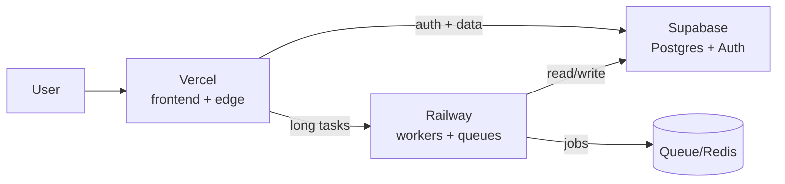

# Stack integration — Vercel + Supabase + Railway

> A common modern stack: Vercel for the frontend/edge, Supabase for data + auth, Railway for workers and anything long-running.

## The stack

- **Vercel** renders the UI and hosts light API routes / edge middleware.
- **Supabase** holds Postgres, Auth, Storage, Realtime; the frontend talks to it directly using the anon key + RLS for safe client access, or via Vercel functions using the service_role key for privileged ops.
- **Railway** runs workers, cron, schedulers, queue consumers, and long-running processes Vercel can't host (e.g. ingestion, ML preprocessing, webhooks that need >serverless timeout).

## Shared concerns (where mistakes happen)

- **Secrets across platforms** — Supabase URL + anon key can live in Vercel/Railway env; the **service_role key must never** reach the browser. Keep per-platform env stores; don't commit secrets. See [[supabase]] admin section.
- **CORS** — Supabase Auth/Storage and Railway APIs must allow your Vercel domain(s), including preview domains if you call backend from previews.
- **Networking** — Vercel functions and Railway workers egress over the public internet; for Supabase use the connection pooler (IPv6/pooler) to avoid connection exhaustion and IPv4 quirks.
- **Deploy ordering** — schema migrations (Supabase) before frontend deploys that depend on them; workers (Railway) rolled after their queue contract is stable.
- **Database connections** — serverless (Vercel) opens many short-lived connections → use Supabase's pooler (Supavisor), not a direct PG connection per request. See [[supabase]].
- **Long tasks** — don't run them in Vercel functions; enqueue to Railway. See [[vercel]] limits.

## When NOT to use this combo

- **Heavy GPU AI inference** — none of the three do GPU; use Vultr/Hetzner/RunPod or a hosted API. See [[03-Inference-Deployment/self-hosted-servers]].
- **Tight cost sensitivity at scale** — usage overages on all three can stack; a single self-hosted box (Hetzner/Vultr) may be cheaper for steady, predictable load. See [[08-Consulting-and-Architecture/cloud-selection]].
- **Strong compliance/data-residency needs** that require single-tenant control — consider self-hosted Postgres on your own cloud.
- **You just need a DB** — Supabase alone is enough; don't add Vercel/Railway unnecessarily ([[08-Consulting-and-Architecture/architectural-mindset]] — simplest sufficient).

## Admin checklist for the stack

- [ ] Secrets isolated per platform; service_role never in client bundles.
- [ ] CORS allowlists current (prod + preview domains).
- [ ] Supabase pooler used by all serverless clients.
- [ ] Backups: Supabase PITR enabled; Railway volumes backed up; Vercel is stateless (no backup needed).
- [ ] Observability: logs + alerts on all three; billing/usage alerts set.
- [ ] Access: SSO/teams configured; least-privilege roles.
- [ ] Deploy order documented (migrations → workers → frontend).

## Links

- [Supabase connection pooling docs](https://supabase.com/docs/guides/database/connecting-to-postgres) — pooler vs direct.
- [Vercel + Supabase integration guide](https://vercel.com/integrations/supabase) — official pairing.
- [Railway + Supabase templates](https://docs.railway.com/platform/use-cases) — use cases.

## Related
- [[platforms-overview]], [[vercel]], [[supabase]], [[railway]], [[06-MLOps-Caveats/deployment-pitfalls]]
